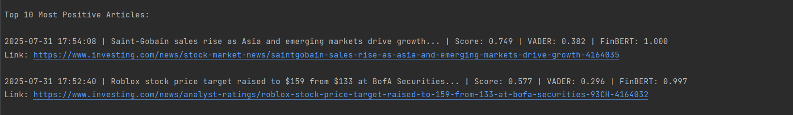
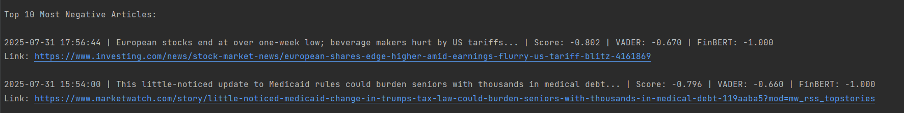

# Financial News Sentiment Analyzer

This Python project fetches financial news from popular RSS feeds and performs sentiment analysis using both traditional and transformer-based NLP models (VADER + optional FinBERT). It classifies articles as Positive, Negative, or Neutral and displays a ranked list of the most impactful stories.

---

## Features

- Fetches articles from major financial RSS sources
- Cleans and parses headlines and summaries
- Performs sentiment analysis using:
  - NLTK’s VADER (default)
  - FinBERT (optional transformer model)
- Displays top positive and negative headlines
- Keyword-based scoring enhancements
- CLI flag to disable FinBERT (`--no-finbert`)
- Visual feedback for loading and execution

---

## Requirements

Install dependencies into a virtual environment (recommended):

```bash
python -m venv venv
source venv/bin/activate  # On Windows: venv\Scripts\activate
pip install -r requirements.txt
```

---

## Usage

Run the script from the command line:

```bash
python main.py
```

Or a faster version (with finBERT disabled) can be ran instead:

```bash
python main.py --no-finbert
```

---

## Example Output

Here's an example of what the sentiment analysis output looks like in the terminal:




